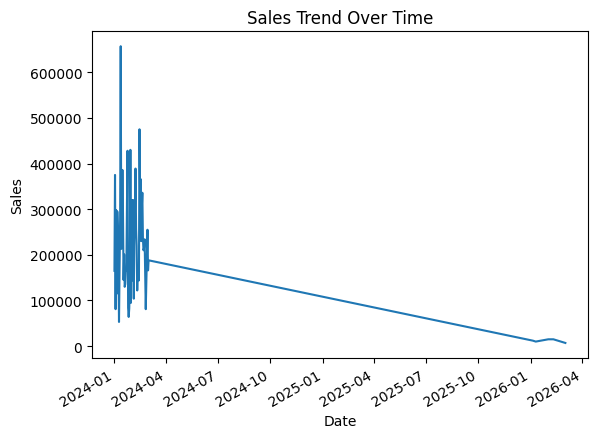
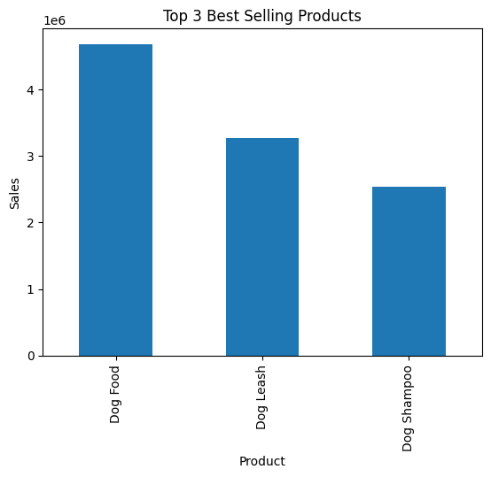

# 🐶 Pet Store E-commerce Sales Analysis

## 📌 Project Overview
This project analyzes e-commerce sales data using **Python, Pandas, MySQL, and Matplotlib**.

The objective of this analysis is to identify **top-selling products, revenue trends, and purchasing patterns** in an online pet store.

---

## 📊 Dataset

The dataset contains simulated transaction records from an e-commerce pet store including products such as dog snacks, toys, and accessories.

| Column       | Description        |
|--------------|--------------------|
| order_id     | Order ID           |
| order_date   | Date of order      |
| product_name | Product name       |
| price        | Product price      |
| quantity     | Quantity purchased |
| sales        | Total sales amount |

Sales column was calculated as:

```
sales = price * quantity
```

---

## 🛠 Tech Stack

- Python  
- Pandas  
- MySQL  
- Matplotlib  
- Jupyter Notebook (.ipynb)

---

## 📈 Analysis Process

### 1️⃣ Data Import

Load data from MySQL database using pandas.

```python
import pandas as pd
import pymysql

conn = pymysql.connect(
    host='localhost',
    user='root',
    password='your_password',
    db='ecommerce'
)

df = pd.read_sql("SELECT * FROM orders", conn)
```

---

### 2️⃣ Data Cleaning

Create the sales column.

```python
df["sales"] = df["price"] * df["quantity"]
```

Check dataset structure.

```python
df.info()
df.describe()
```

---

### 3️⃣ Exploratory Data Analysis (EDA)

Product sales frequency.

```python
df["product_name"].value_counts()
```

Total sales by product.

```python
df.groupby("product_name")["sales"].sum()
```

---

## 🗄 SQL Analysis

Example SQL queries used for analysis.

### Total Sales by Product

```sql
SELECT 
    product_name,
    SUM(price * quantity) AS total_sales
FROM orders
GROUP BY product_name
ORDER BY total_sales DESC;
```

### Top Selling Products

```sql
SELECT 
    product_name,
    SUM(quantity) AS total_quantity
FROM orders
GROUP BY product_name
ORDER BY total_quantity DESC
LIMIT 5;
```

---

## 📊 Key Insights

- **Dog Snack generated the highest total revenue**
- Snack products showed **higher purchase frequency**
- Some higher priced products had **lower sales volume**

---

## 📉 Visualization

### Sales by Product


### Sales Trend


### Top Selling Products


---

## 📂 Project Structure

```
data-analysis-portfolio
│
├─ projects
│   └─ 01-ecommerce-analysis
│       ├─ ecommerce_sales_analysis.ipynb
│       ├─ README.md
│       └─ images
│           ├─ sales_by_product.png
│           ├─ sales_trend.png
│           └─ top_products.png
```

---

## 🚀 Future Improvements

- Monthly sales trend analysis
- Customer segmentation
- Product recommendation analysis