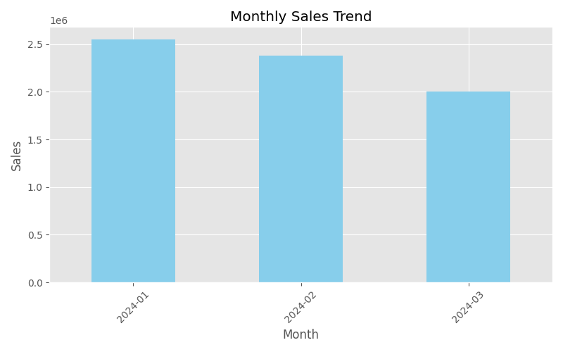
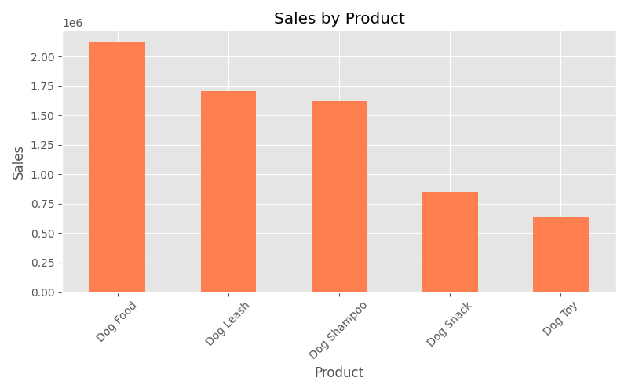
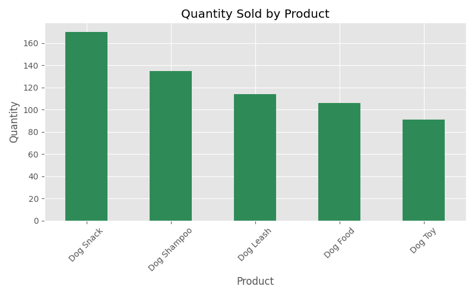
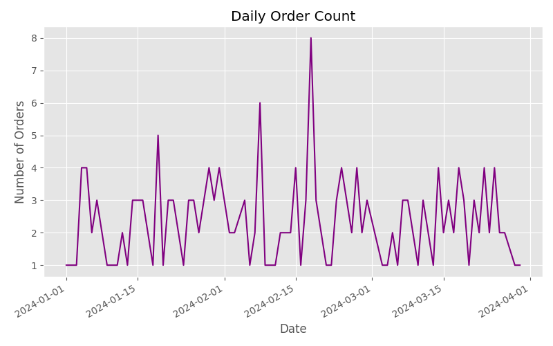
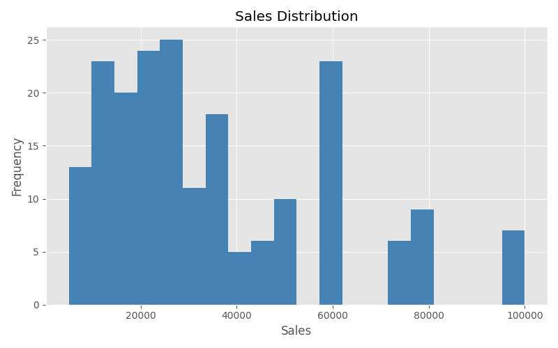

# Pet Store E-commerce Sales Analysis

## Project Overview

This project analyzes synthetic e-commerce sales data for a pet store.
The objective is to explore sales trends and identify top-performing products.

---

## Dataset

The dataset was generated using Python to simulate transaction records.

Columns in the dataset:

| Column       | Description                    |
| ------------ | ------------------------------ |
| order_id     | Order identifier               |
| order_date   | Date of purchase               |
| product_name | Product name                   |
| price        | Product price                  |
| quantity     | Number of items purchased      |
| sales        | Total sales (price × quantity) |

Total records: **200**

---

## Analysis

The following analyses were performed:

* Monthly sales trend
* Sales by product
* Quantity sold by product
* Daily order count
* Sales distribution

---

## Visualization

### Monthly Sales Trend



### Sales by Product



### Quantity Sold by Product



### Daily Order Trend



### Sales Distribution



---

## Tech Stack

* Python
* Pandas
* Matplotlib
* Jupyter Notebook

---

## Project Structure

```
data/
  ecommerce_sales.csv

images/
  monthly_sales.png
  product_sales.png
  product_quantity.png
  daily_orders.png
  sales_distribution.png

notebooks/
  ecommerce_sales_analysis.ipynb
```

---

## Key Insights

* Monthly sales fluctuate across the three-month period.
* Higher priced products such as Dog Food contribute significantly to revenue.
* Lower priced products sell frequently but generate smaller revenue per order.
* Both quantity sold and price influence product performance.

---

## Author

Data Analysis Portfolio Project
